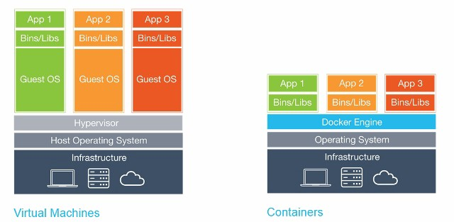
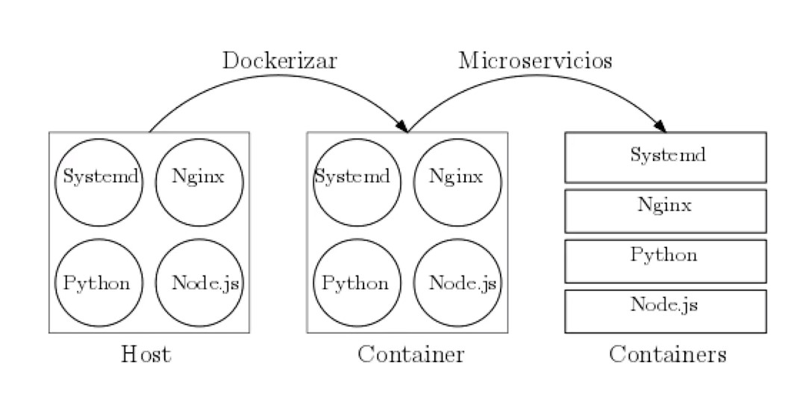
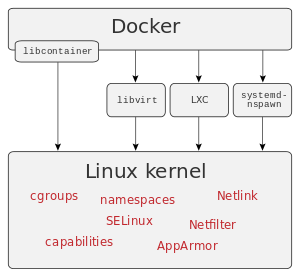
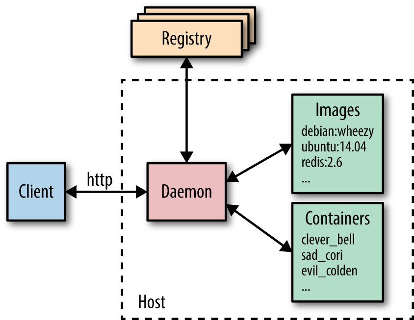

<!-- $theme: gaia -->

<!-- template: default -->
# Taller ==Docker==
# 

---

<!-- template: gaia -->
# 
##### by [David Carvajal](https://github.com/davcd)

---

<!-- template: invert -->
#### https://github.com/davcd/coders-docker

---

<!-- template: gaia -->
# Índice
- Introducción
- Imágenes 
- Contenedores
- Avanzado

---

<!-- template: default -->
# Índice
- ==**Introducción**==
	- Maquinas Virtuales vs. Contenedores
	- Contenedores y microservicios 	 
	- ¿Qué es Docker?
	- Características
	- Componentes
	- Docker-Hub
	- Comandos básicos	 

---

<!-- template: default -->
# Índice
- ==**Imágenes**==
	- Definición
	- Comandos
	- Dockerfile
	- Build caché
	- Buenas Prácticas 	 

---

<!-- template: default -->
# Índice
- ==**Contenedores**==
	- ¿Qué es docker-compose?
	- docker-compose.yml
	- Comandos
	- Volumenes
	- Redes

---

<!-- template: default -->
# Índice
- ==**Avanzado**==
	- Gestión de clusters 

---

<!-- template: default -->
# Índice
- ==**Introducción**==
	- Maquinas Virtuales vs. Contenedores
	- Contenedores y microservicios 	 
	- ¿Qué es Docker?
	- Características
	- Componentes
	- Docker-Hub
	- Comandos básicos	 

---

<!-- *template: invert -->
<!-- page_number: true -->
####	Maquinas Virtuales vs. Contenedores
> En informática, una máquina virtual es un software que simula un sistema de computación y puede ejecutar programas como si fuese una computadora real.
>
> <small>-- *[Máquina Virtual - Wikipedia](https://es.wikipedia.org/wiki/M%C3%A1quina_virtual)*</small>

---

<!-- *template: invert -->
<!-- page_number: true -->
####	Maquinas Virtuales vs. Contenedores
> Un contenedor es una unidad estándar de software que empaqueta todas sus dependencias para que la aplicación se ejecute de forma rápida y confiable de un entorno informático a otro.
>
> <small>-- *[Docker Resources](https://www.docker.com/resources/what-container)*</small>

---
<!-- template: default -->
#### Maquinas Virtuales vs. Contenedores
# 

---

<!-- template: default -->
#### Contenedores y microservicios
# 

---

<!-- *template: invert -->
<!-- page_number: true -->
#### ¿Qué es Docker?
> Docker es un proyecto de código abierto que automatiza el despliegue de aplicaciones dentro de **contenedores de software**, proporcionando una capa adicional de abstracción y automatización de virtualización de aplicaciones en múltiples sistemas operativos.
>
> <small>-- *[Docker (software) - Wikipedia](https://es.wikipedia.org/wiki/Docker_(software))*</small>

---

<!-- template: gaia -->
#### Características
- Docker Inc.
- Open Source
- Primera release 2013
- Community Edition y Enterprise Edition
- "Build, Ship and Run. Any application, Anywhere"
- Portabilidad, Inmutabilidad y Ligereza

---

<!-- template: default -->
#### Características
# 

---

<!-- template: default -->
#### Componentes
# 

---

<!-- template: gaia -->
# Docker Hub
###### El registro oficial de Docker

---

<!-- template: default -->
# Comandos Comunes

---

<!-- template: default -->
# Índice
- ==**Imágenes**==
	- Definición
	- Comandos
	- Dockerfile
	- Build caché
	- Buenas Prácticas 	 

---

<!-- template: invert -->
#### Definición
###### Una ==Imagen== es la información necesaria para arrancar un contenedor. Se compone de un sistema de ficheros y otros metadatos:

---

<!-- template: gaia -->
#### Comandos
- *docker build*
- *docker login*
- *docker pull*
- *docker image ls*
- *docker inspect* 
(ó *docker inspect -f '{{.Size}}' imagen*)
- *docker image rm*
(ó *docker rmi*)

---

<!-- template: default -->
#### Dockerfile
```
FROM ubuntu:latest
RUN apt-get update -y
RUN apt-get install -y python-pip python-dev
WORKDIR /app
ENV DEBUG=True
EXPOSE 80
VOLUME /data
COPY . /app
RUN pip install -r requirements.txt
ENTRYPOINT ["python"]
CMD ["app.py"]
```

---

<!-- template: default -->
#### Build caché
- Proceso costoso y repetitivo
- Imagen base (*docker build --pull*)
- Capas
- Invalidaciones de cache (*docker build --no-cache*)
- Instrucciones ADD y COPY

---

#### Buenas Prácticas
	1. Usa .dockerignore
	2. Reduce el tamaño de tus imágenes al mínimo (alpine)
	3. Ejecuta sólo un proceso por contenedor
	4. Minimiza el número de capas de tu imagen.
	5. Optimiza el uso de la cache .
	6. Parametriza tus Dockerfiles usando argumentos
	
---

<!-- template: default -->
# Índice
- ==**Contenedores**==
	- ¿Qué es docker-compose?
	- docker-compose.yml
	- Comandos
	- Volumenes
	- Redes

---
<!-- template: invert -->
#### docker-compose
###### Proyecto open source que permite definir aplicaciones muilti-contenedor de una manera sencilla y declarativa. Es una herramienta ideal para gestionar entornos de desarrollo.

---

<!-- template: default -->
#### Dockerfile
```
db:
   image: mysql:5.7
   restart:always
   enviroment:
   MYSQL_ROOT_PASSWORD: password
   
wordpress:
   image: wordpress:latest
   depends_on:
     - db
   ports:
     - "8000:80"
```

---

<!-- template: default -->
#### Comandos
- *docker-compose up -d*
- *docker-compose pull*
- *docker-compose build*
- *docker-compose push*
- *docker-compose run* 
- *docker-compose rm*

---

<!-- template: default -->
#### Redes
- Bridge
- Host
- None 
- docker network (create | ls | inspect | rm)

---

<!-- template: default -->
# Índice
- ==**Avanzado**==
	- Gestión de clusters 

---

<!-- template: default -->
#### Gestión de clusteres
# 

---

<!-- template: gaia -->
# FIN

